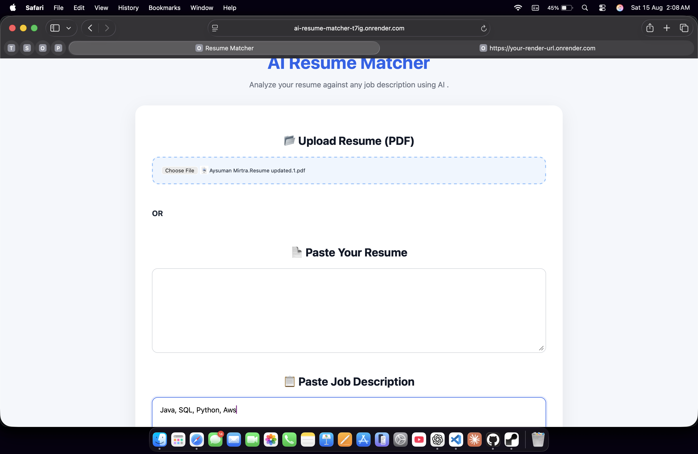
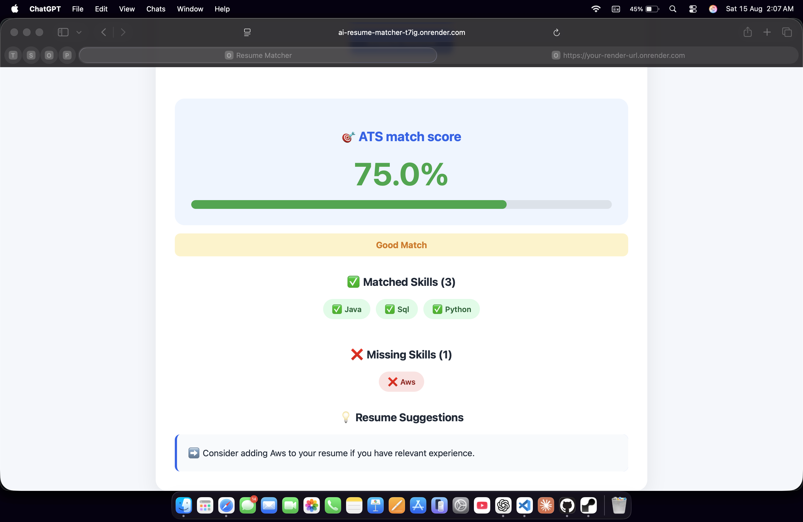

# 🤖 AI Resume Matcher

An ATS-style resume analysis web application built with Python and Flask. It compares resume content with job descriptions, calculates a keyword-based match score, and identifies matched and missing skills.

## 🔗 Live Demo

https://ai-resume-matcher-t7ig.onrender.com

## 📸 Screenshots

### 🏠 Application Interface



### 📊 Resume Analysis Results



## 🚀 Features

- 📄 Upload resume as a PDF
- 📝 Paste resume text manually
- 💼 Enter job descriptions
- 📊 Calculate resume-to-job match score
- ✅ Identify matched keywords
- ❌ Identify missing keywords
- 💡 Generate resume improvement suggestions
- 📱 Responsive web interface
- 🌐 Deployed as a live web application

## 🛠️ Technologies Used

- Python
- Flask
- HTML
- CSS
- pdfplumber
- Regular Expressions
- Git & GitHub
- Render

## ⚙️ How It Works

1. Upload your resume in PDF format or enter your resume text manually.
2. Enter the job description you want to compare against.
3. The application extracts and cleans the resume content.
4. Resume and job-description keywords are normalized and compared.
5. A keyword-based match score is calculated.
6. The application identifies matching and missing keywords.
7. Resume improvement suggestions are generated based on missing keywords.

## 📁 Project Structure

```text
AI-Resume-Matcher/
│
├── app.py
├── requirements.txt
├── README.md
├── .gitignore
│
├── templates/
│   └── index.html
│
├── static/
│   └── style.css
│
└── screenshots/
    ├── homepage.png
    └── results.png